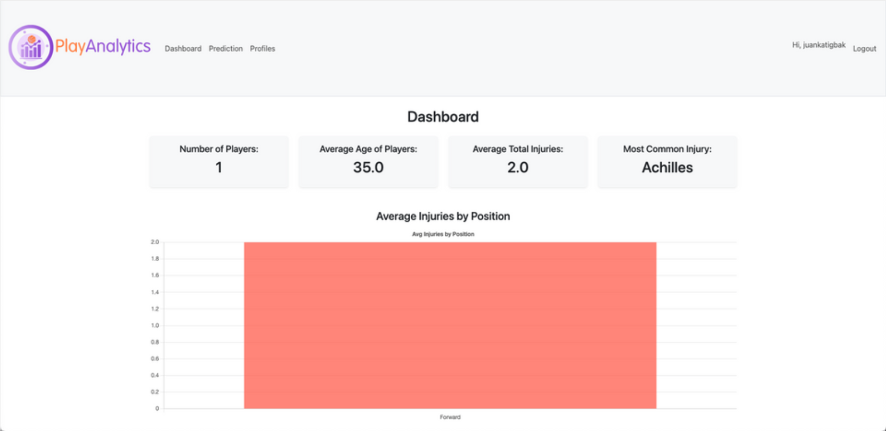
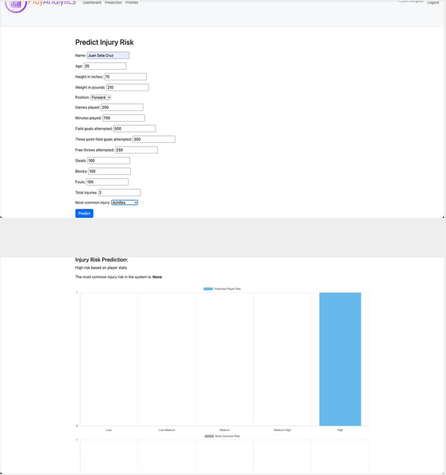
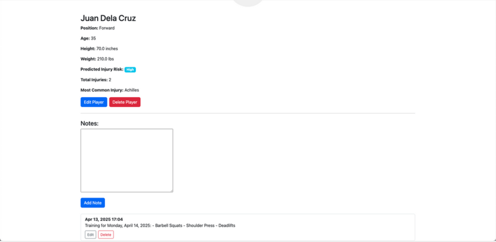
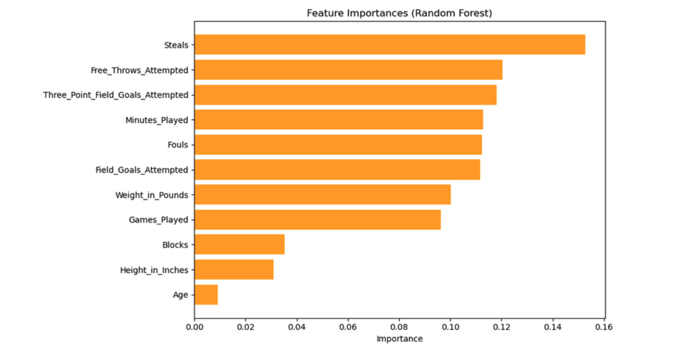

# PlayAnalytics
### Full-Stack ML Web Application | Injury Risk Prediction for Basketball Athletes

A solo-built web application that predicts basketball injury risk using machine learning and delivers data-driven insights for athletes and coaches. Rated **4.65 / 5** by 17 users in a post-development feedback survey.

---

## The Problem

There is such a thing as injury risk data. Unfortunately, the supposed tools that should act on them do not, at least not for anyone outside a professional analytics team.

Coaches and athletes do track performance and they do log injuries. However, the gap between raw data and actionable insight is wide, and most of the available tools either require a data background to operate or sit behind enterprise-level infrastructure that recreational and semi-professional teams cannot access.

Therefore, the gap is not in the science but rather the delivery.

This is where PlayAnalytics comes in. PlayAnalytics closes the gap which is a simple portal that lets coaches and athletes enter whatever they already track, run a machine learning prediction, and then get a clear injury risk label with no analytics background required.

---

## What PlayAnalytics Does

**Dashboard**
A real-time roster overview that updates automatically as players are added. It displays total players, average age, average total injuries, and most common injury, alongside three interactive charts:
- Average injuries by position (bar chart)
- Risk level distribution per position (stacked bar chart)
- Injury type distribution across all profiles (pie chart)

**Injury Risk Prediction**
Enter a player's performance statistics and injury history to receive a predicted injury risk classification: Low, Low-Medium, Medium, Medium-High, or High, generated by a Random Forest classification model trained on NBA performance data. Results are visualized as bar charts and can be saved directly to the player's profile.

**Player Profiles**
A centralized hub for managing individual athlete records. Each profile displays performance stats, predicted injury risk, most common injury, and a profile photo. Coaches and athletes can log timestamped journal notes per player covering training sessions, injury updates, rehab progress, or general observations with full edit and delete capability.

**User Authentication**
Secure registration, login, and logout via Django's built-in authentication system. All key pages are login-protected.

**Responsive Design**
Fully responsive across desktop, tablet, and mobile via Bootstrap 5.

---

## Screenshots

**Dashboard**

*Real-time roster overview with summary stats and three interactive charts - average injuries by position, risk level distribution, and injury type breakdown.*

---

**Injury Risk Prediction**

*Player stats input form with Random Forest classification output - returns one of five risk labels: Low, Low-Medium, Medium, Medium-High, or High.*

---

**Player Profile**

*Individual athlete record showing performance stats, predicted injury risk, most common injury, and timestamped journal notes for training and rehab tracking.*

---

**Feature Importances (Random Forest)**

*Steals, Free Throws Attempted, and Three-Point Field Goals Attempted ranked as the top injury risk predictors - confirming that active gameplay involvement and workload are stronger indicators than static physical characteristics like height or age.*

---

## Tech Stack

| Layer | Technology |
|---|---|
| Backend | Python 3.12, Django 5.2 |
| Frontend | Bootstrap 5, Chart.js, HTML |
| Machine Learning | scikit-learn (Random Forest Classifier) |
| Data Processing | Pandas 2, NumPy 2 |
| Model Serialization | Joblib 1.4 |
| Authentication | Django Auth (built-in) |
| Image Handling | Pillow 11.1 |
| Database | SQLite (via Django ORM) |

---

## The Machine Learning Model

**Algorithm:** Random Forest Classifier - selected after benchmarking against SVM and XGBoost. Random Forest achieved **96.5% accuracy** on the test set. XGBoost matched that accuracy but produced UndefinedMetricWarning on minority classes due to class imbalance. Random Forest was selected for its robustness, interpretability, and more reliable handling of imbalanced data.

**Data:** Custom-built dataset of 1,000 synthetic player records based on Los Angeles Lakers performance statistics sourced from NBA.com and Pro Sports Transactions. Real player stats were used as the foundation; synthetic records were generated to expand the training set.

**Features used for prediction (11 total):** Age, Height, Weight, Games Played, Minutes Played, Field Goals Attempted, Three-Point Field Goals Attempted, Free Throws Attempted, Steals, Blocks, Fouls.

**Feature engineering:** A `performance_load` metric was computed from in-game workload indicators (Games Played + Minutes Played + Field Goals Attempted + Three-Point FGA + Free Throws Attempted). Risk labels were assigned using a heuristic function that factored in both total injuries and performance load.

**Key finding:** Steals, Free Throws Attempted, and Three-Point Field Goals Attempted were the top predictors of injury risk, confirming that active gameplay involvement and overall workload are stronger injury indicators than static physical characteristics like height or age.

**Model training:** 80/20 train-test split, n_estimators=100. Model and label encoder exported as `rf_injury_model.joblib` and `risk_label_encoder.joblib` via Joblib for deployment.

---

## User Feedback

Validated through a post-development survey with 17 respondents.

| Page / Feature | Result |
|---|---|
| Overall Experience | **4.65 / 5** average rating |
| Landing Page Design | **4.53 / 5** average rating |
| Dashboard charts useful | **88%** rated "Very useful" |
| Dashboard charts easy to understand | **88%** said "Yes" |
| Prediction tool easy to use | **88%** said "Yes" |
| Prediction results helpful | **82%** rated "Very helpful" |
| Player profiles easy to navigate | **94%** said "Yes" |
| Notes and stats tracking valuable | **94%** said "Yes" |

---

## Repository Structure

```
PlayAnalytics/
├── play_analytics/         # Django project config (settings, urls, wsgi)
├── dashboard/              # Dashboard app (roster overview, charts)
├── predictor/              # Injury risk prediction app (ML model, views)
├── player_profiles/        # Player profile and journal notes app
├── users/                  # User authentication app
├── templates/              # HTML templates
├── static/images/          # Static assets
├── media/profile_pictures/ # Uploaded player photos
├── screenshot_dashboard.png
├── screenshot_prediction.png
├── screenshot_profile.png
├── screenshot_feature_importance.png
├── manage.py
└── README.md
```

---

## How to Run

**Requirements:** Python 3.11 or higher

**1. Download the repository**
Click the green `<> Code` button on GitHub and select `Download ZIP`. Extract the folder. If there is a nested folder (e.g. `playanalytics/playanalytics/`), move the inner folder to a convenient location like your Desktop.

**2. Set up a virtual environment**

macOS / Linux:
```bash
python -m venv env
source env/bin/activate
```

Windows:
```bash
python -m venv env
env\Scripts\activate
```

**3. Install dependencies**
```bash
pip install django django-bootstrap5 joblib scikit-learn numpy pandas pillow
```

**4. Run the application**

macOS / Linux:
```bash
cd playanalytics
python manage.py runserver
```

Windows:
```bash
cd %USERPROFILE%\Desktop\playanalytics
python manage.py runserver
```

**5. Open in browser**
```
http://127.0.0.1:8000/
```

**First-time users:** The Dashboard will be empty until players are added. Start on the Prediction page: enter a player's stats, run the prediction, and save to profile. The Dashboard updates automatically as players are added.

---

## Known Limitations

- Editing a player's performance stats in their profile does not automatically re-run the prediction. The risk label must be updated manually using one of the valid values: Low, Low-Medium, Medium, Medium-High, or High.
- The dataset is weighted toward High-risk players due to the nature of NBA roster data. The model performs best on High and Medium risk classifications.
- The Training page (planned for workout regimen guidance) was scoped out of the final version due to unavailability of suitable NBA training datasets. Planned as a future feature.

---

## Acknowledgements

- **Eric Matthes** - *Python Crash Course, 3rd Edition* (No Starch Press) - Django foundation
- **KenBroTech (Kenneth Broni)** - YouTube channel - Django and machine learning integration

---

## Author

**Juan Carlos Katigbak**

PlayAnalytics was built end-to-end solo: problem framing, data sourcing, feature engineering, model benchmarking (Random Forest vs SVM vs XGBoost), Django app development, and a 17-respondent post-development survey.

[LinkedIn](https://linkedin.com/in/juan-carlos-katigbak) | [GitHub](https://github.com/juancarloskatigbak8)
